# Neural Networks and Deep Learning
## Greifswald, September 23-25, 2019
Go to [Moodle](https://moodle-web.uni-greifswald.de/moodle/course/view.php?id=5405) for
 - Q & A forum
 - feedback
 - announcements
 - quiz

## Course Overview
You will get practical knowledge to perform general machine learning and, in particular, computer vision tasks with TensorFlow 2 and the neccessary theoretical background to troubleshoot when transferring the knowledge to solve own problems.

### (Stochastic) Gradient Descent

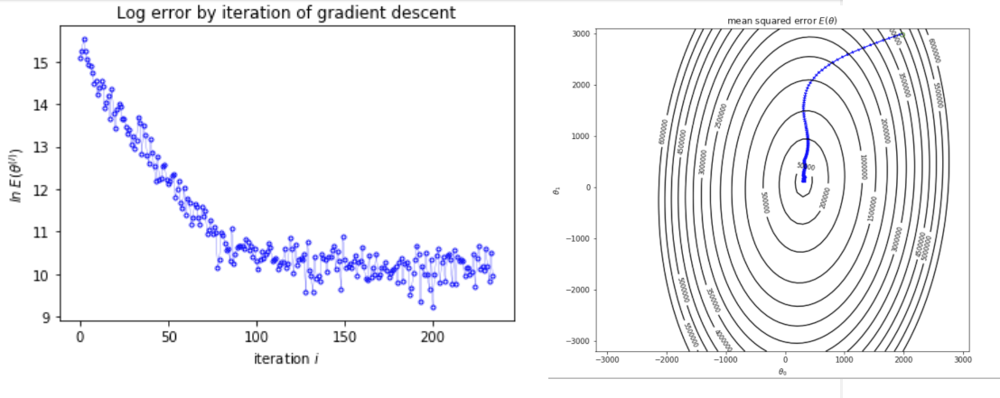

### Linear Regression with TensorFlow 2

  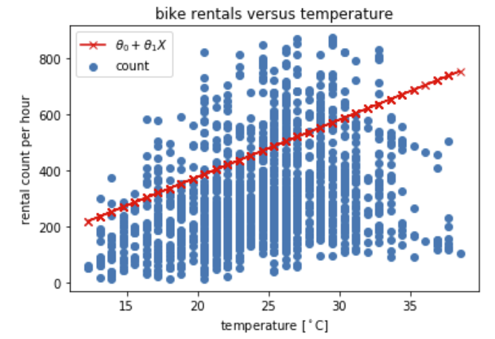
  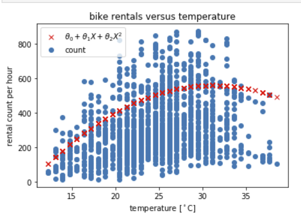

### Expore the Effect of Critical Parameters

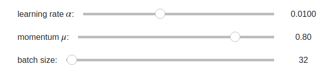

### Derive and Optimize

 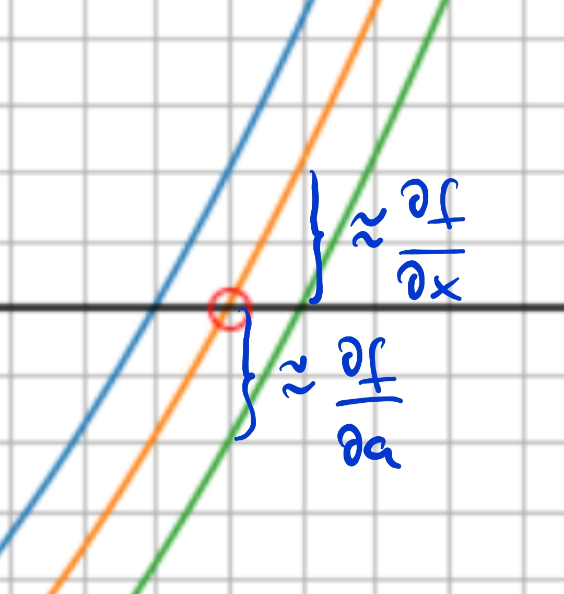

### Fully-Connected Neural Network for Regression

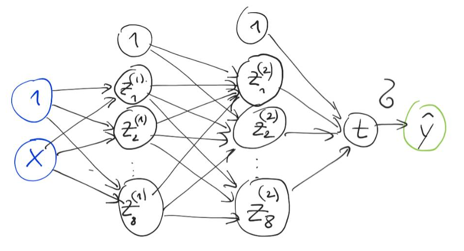
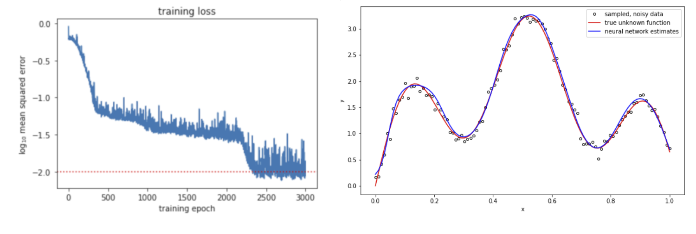

### Convolutional Neural Networks (Architectures, Filters, Feature Maps)

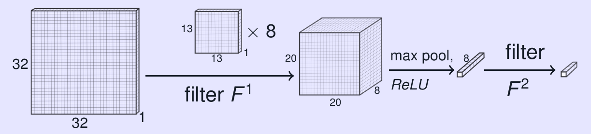
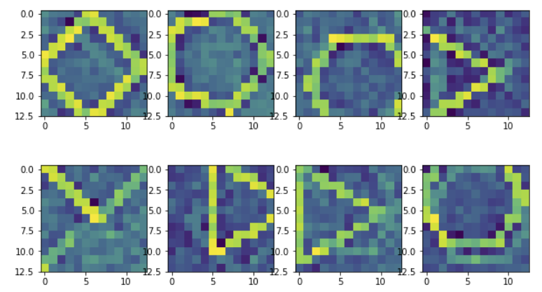
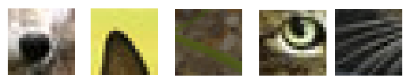

### Fooling a CNN - Make it 'Think' a Plant is a Cat

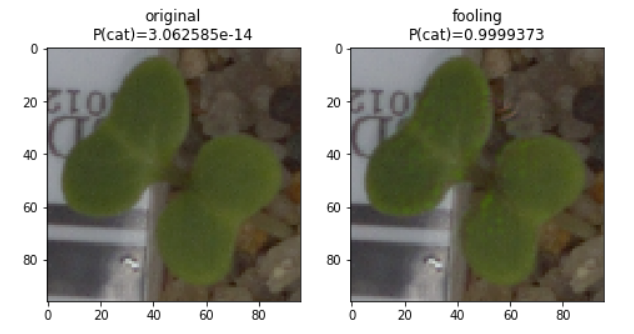

